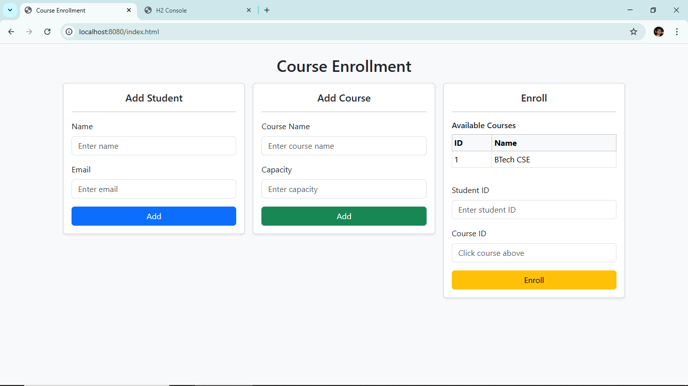
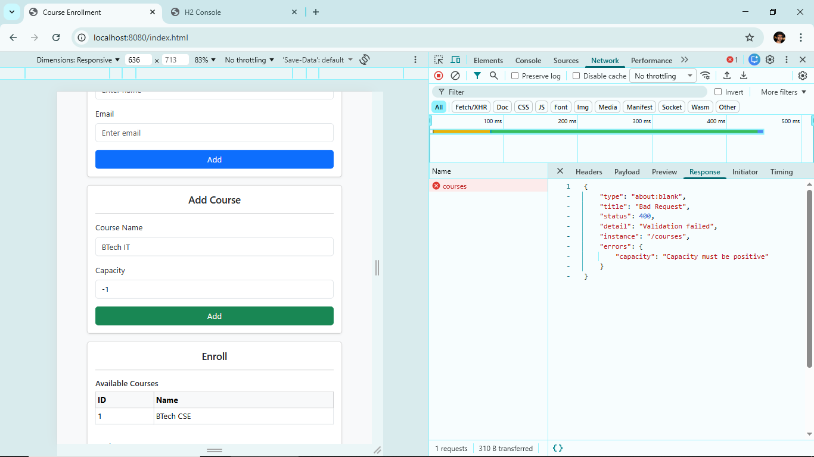
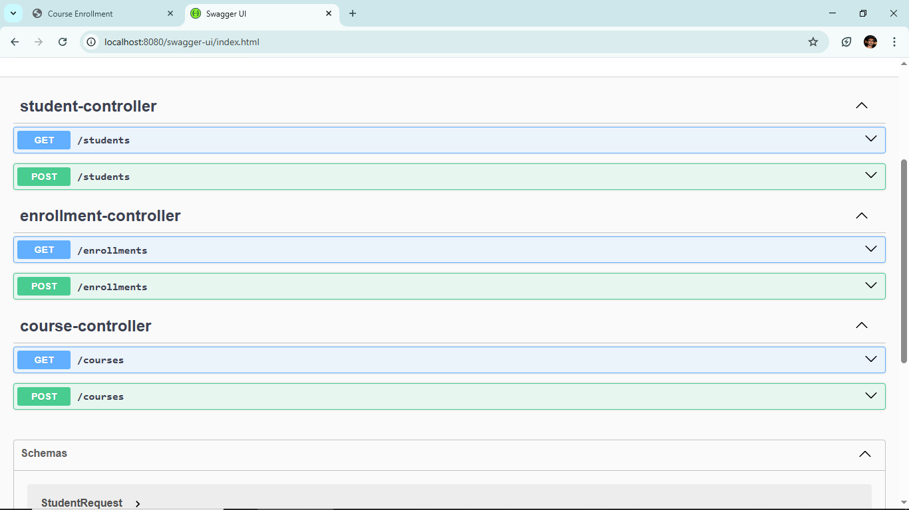

# Student Course Enrollment System

A Spring Boot–based backend application that manages **students, courses, and enrollments**, exposing RESTful APIs and a lightweight browser-based admin UI using **HTML, Bootstrap, and minimal JavaScript**.

This project demonstrates **backend-focused design**, clean REST architecture, validation, exception handling, and containerized deployment using **Docker**.

---

## 🌐 Live Deployment URL

**Base URL:**  
https://course-enrollment-spring.onrender.com/

---

## 🚀 Features

- Add and manage students
- Add and manage courses with capacity limits
- Enroll students into courses
- Prevent duplicate enrollments
- Handle course capacity constraints
- RESTful API design with proper HTTP status codes
- Global exception handling using `ProblemDetail`
- Lightweight admin UI (no frontend framework)
- Dockerized deployment
- Deployed on **Render**

---

## 🧱 Tech Stack

### Backend

- Java 21
- Spring Boot
- Spring Web (REST)
- Spring Validation
- Spring Data JPA
- H2 Database (demo purpose)

### Frontend

- HTML5
- Bootstrap 5
- Vanilla JavaScript (`fetch` API)

### DevOps

- Docker (multi-stage build)
- Render (container-based deployment)

---

## 🏗️ Architecture Overview

```text
Browser (HTML + JS)
↓
REST Controllers (Spring Boot)
↓
Service Layer (Business Logic)
↓
Repository Layer (JPA)
↓
Database (H2)
```

- UI communicates **only via REST APIs**
- Business rules enforced in service layer
- Errors mapped to HTTP responses using `@RestControllerAdvice`

---

## 📸 Screenshots

> Screenshots taken from the deployed application UI.

### Home Page



### Validation / Error Handling



### Swagger UI



---

## 🔗 API Endpoints

### Students

| Method | Endpoint    | Description     |
| ------ | ----------- | --------------- |
| POST   | `/students` | Add new student |

---

### Courses

| Method | Endpoint   | Description      |
| ------ | ---------- | ---------------- |
| GET    | `/courses` | List all courses |
| POST   | `/courses` | Add new course   |

---

### Enrollments

| Method | Endpoint       | Description                |
| ------ | -------------- | -------------------------- |
| POST   | `/enrollments` | Enroll student into course |

---

## ⚠️ Error Handling

- Validation errors → **400 Bad Request**
- Resource not found → **404 Not Found**
- Duplicate enrollment → **409 Conflict**
- Course capacity full → **409 Conflict**

All error responses follow **RFC 7807 (`ProblemDetail`)** format.

---

### 👤 Author

Sanjeev Maurya
Aspiring Java Backend Developer
